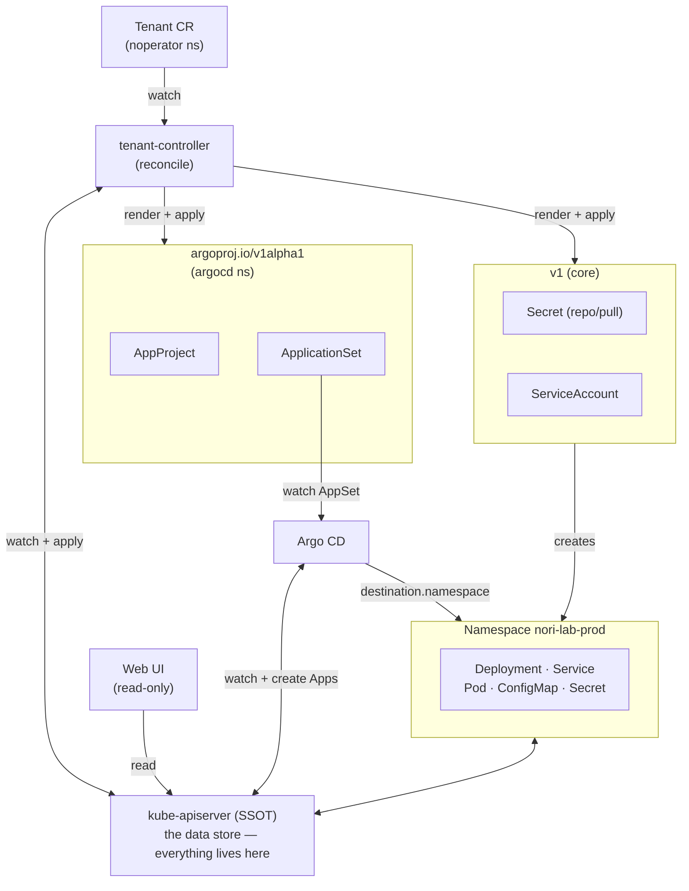

# noperator — Architecture

The operator turns a `Tenant` CR into Argo CD primitives; Argo CD then fans
those out into the tenant's workloads. The kube-apiserver is the single source
of truth (SSOT) everything flows through.

